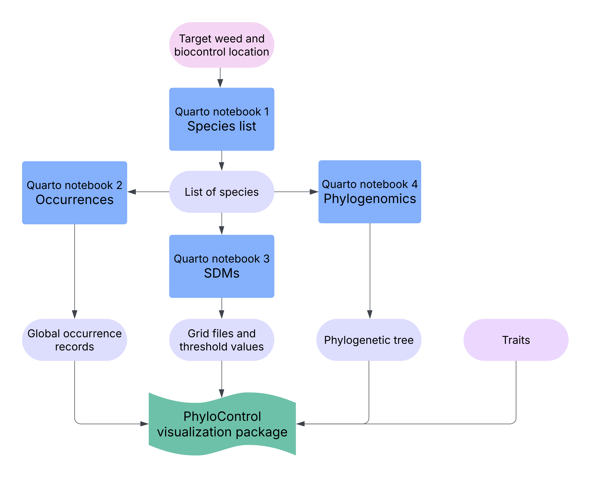
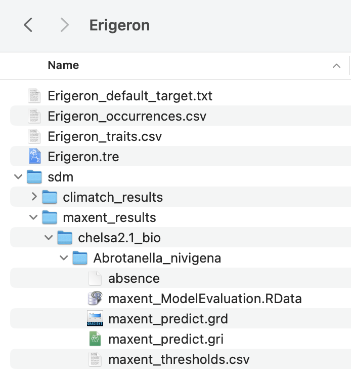

<!-- README.md is generated from README.Rmd. Please edit that file -->

# `phylocontrol-geninput`

<!-- badges: start -->

<!-- badges: end -->

A phylogeny and spatial data visualisation interface for risk analysis
and decision support in weed biological control.

## Introduction

PhyloControl is a user-friendly visualisation tool to aid biocontrol
researchers in their decision-making during risk analysis. Thorough
host-specificity testing is crucial to minimise the risk of off-target
damage by biocontrol agents to native and economically important plant
species. To facilitate this, host test lists need to be developed from
an understanding of evolutionary relationships. The process of obtaining
a host test list is currently not standardised, and the manual steps may
be time-consuming and challenging, introducing risks if taxonomic
associations with the target weeds are uncertain or if the taxonomy of
potential non-target species is poorly resolved. PhyloControl integrates
taxonomic data, molecular data, spatial data, and plant traits in an
intuitive interactive interface, empowering biocontrol practitioners to
summarise, visualise, and analyse data efficiently.

This repository,
[`phylocontrol-geninput`](https://github.com/csiro/phylocontrol-geninput),
contains the four Quarto notebooks to generate inputs for the R Shiny
visualisation application. The application is available from the
[`phylocontrol-viz`
repository](https://github.com/csiro/phylocontrol.viz) and contains the
source code for the `{phylocontrol.viz}` package.

## Install and run

To run these Quarto notebooks, clone this repository to your local
computer and open the `.qmd` files using RStudio to edit and run them.
Each notebook is self-contained and can be run independently. This
allows users to skip steps if you already have input data from other
sources.

## Key outputs from each notebook

**`1_Species_list.qmd`**

A csv file containing a list of scientific names of the target weed and
related species e.g. `Erigeron_species_list.csv`

**`2_Occurrences.qmd`**

A csv file of point occurrence data containing the key columns
‘species’, ‘decimalLatitude’, ‘decimalLongitude’, and ‘country’
e.g. `Erigeron_occurrences.csv`

**`3_Species_distribution_modelling.qmd`**

A `sdm/` folder containing folders `maxent_results/` and/or
`climatch_results/`. There is another directory indicating the climate
layers used e.g. `chelsa2.1_bio/` which then contains a folder for each
species run. Key outputs for visualisation are the grid files
e.g. `maxent_predict.grd` and `climatch_predict.grd` and in the case of
MaxEnt, the `maxent_thresholds.csv` file.

**`4_Sequences_and_phylogenomics.qmd`**

A phylogenetic tree in Newick format e.g. `Erigeron.tre`. It should be
outgroup rooted.

It is recommended to copy the output files needed for the PhyloControl
visualisation application into a separate directory set up specifically
for the visualisation app which contains a folder for each study group
e.g. `App_data/Erigeron/`.

You can also optionally add a text file containing the default target
weed as well as a csv file containing traits to visualise with heatmaps.
For an example of this directory structure, have a look at the App_data
folder in the [supplementary data for the
manuscript](https://data.csiro.au/collection/csiro:64365).

## Demo server

Try out the [demo version of the visualisation
application](https://shiny.csiro.au/phylocontrol-viz-demo/).

## Code of Conduct

Please note that this project is released with a [Contributor Code of
Conduct](https://contributor-covenant.org/version/2/1/CODE_OF_CONDUCT.html).
By contributing to this project, you agree to abide by its terms.

## Citing PhyloControl

The PhyloControl paper is currently in review. For now, please cite the
[pre-print on bioRxiv](https://doi.org/10.1101/2025.06.11.658203).

> Stephanie H. Chen, Lauren Stevens, Ben Gooden, Michelle A. Rafter,
> Nunzio Knerr, Peter H. Thrall, Louise Ord, Alexander N. Schmidt-Lebuhn
> (2025). PhyloControl: a phylogeny visualisation platform for risk
> analysis in weed biological control. bioRxiv. DOI:
> [10.1101/2025.06.11.658203](https://doi.org/10.1101/2025.06.11.658203)
